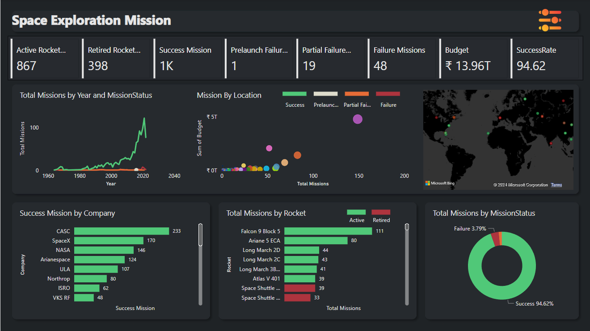

# Space Exploration Missions Dashboard

Welcome to the Exploratory Data Analysis (EDA) project on Space Exploration Missions! This repository contains Power BI report that analyze data related to space exploration missions.

## Overview

Designed a Power BI dashboard to analyze space exploration missions data with Exploratory Data Analysis techniques.
* Analyzed rocket status, mission success rates, and launch details across multiple countries to gain insights into trends.
* Created visualizations showing mission trends over time, company performance, and geographic launch locations.
* Highlighted key metrics like 1K successful missions, 827 active rockets, and a 13.51T budget with a 94.62% success rate.

## Dashboard Preview

